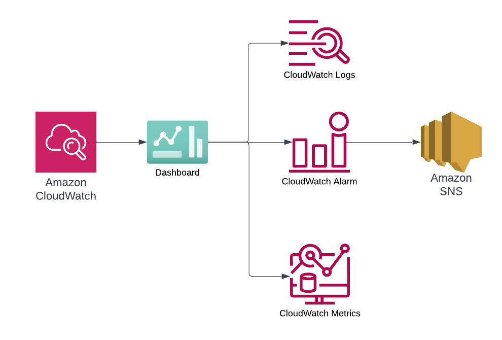

# serverless-python-demo

**[📜Documentation](https://ran-isenberg.github.io/serverless-python-demo/)**

## **The Pragmatic Python Serverless Developer**

## **The Problem**

Starting a Serverless service can be overwhelming. You need to figure out many questions and challenges that have nothing to do with your business domain:

- How to deploy to the cloud? What IAC framework do you choose?
- How to write a SaaS-oriented CI/CD pipeline? What does it need to contain?
- How do you write a Lambda function?
- How do you handle observability, logging, tracing, metrics?
- How do you handle testing?

## **The Solution**

This project provides a serverless service which is based an opinionated approach to Python project setup, testing, profiling, deployments, and operations.
Learn about many open source tools, including Powertools for AWS Lambda—a toolkit that can help you implement serverless best practices and increase developer velocity.

### **Serverless Template**

The service we present here started from the [AWS Lambda Handler Cookbook](https://github.com/ran-isenberg/aws-lambda-handler-cookbook), a serverless service template project.

The template project provides a working, deployable, open source-based, serverless service template with an AWS Lambda function and AWS CDK Python code with all the best practices and a complete CI/CD pipeline.

You can start your own service in three clicks.

### The Products service

  

### **Features**

- Python Serverless service with a recommended file structure.
- CDK infrastructure with infrastructure tests and security tests.
- Both synchronous and asynchronous resources
- CI/CD pipelines based on Github actions that deploys to AWS with python linters, complexity checks and style formatters.
- CI/CD pipeline deploys to dev/staging and production environment with different gates between each environment
- Makefile for simple developer experience.
- The AWS Lambda handler embodies Serverless best practices and has all the bells and whistles for a proper production ready handler.
- AWS Lambda handler uses [AWS Lambda Powertools](https://docs.powertools.aws.dev/lambda-python/): logger, tracer, metrics, event handler, validation, batch
- AWS Lambda handler three layer architecture: handler layer, logic layer and data access layer (integration)
- Idempotent API
- CloudWatch dashboards - High level and low level including CloudWatch alarms
- Unit, infrastructure, security, integration and end to end tests.

While the code examples are written in Python, the principles are valid to any supported AWS Lambda handler programming language.

#### **Monitoring Design**

  

#### **Async Testing Design**

  

## **License**

This library is licensed under the MIT License. See the [LICENSE](https://github.com/ran-isenberg/serverless-python-demo/blob/main/LICENSE) file.

Maintained by [Ran Isenberg](https://www.ranthebuilder.cloud/) and Heitor Lessa
