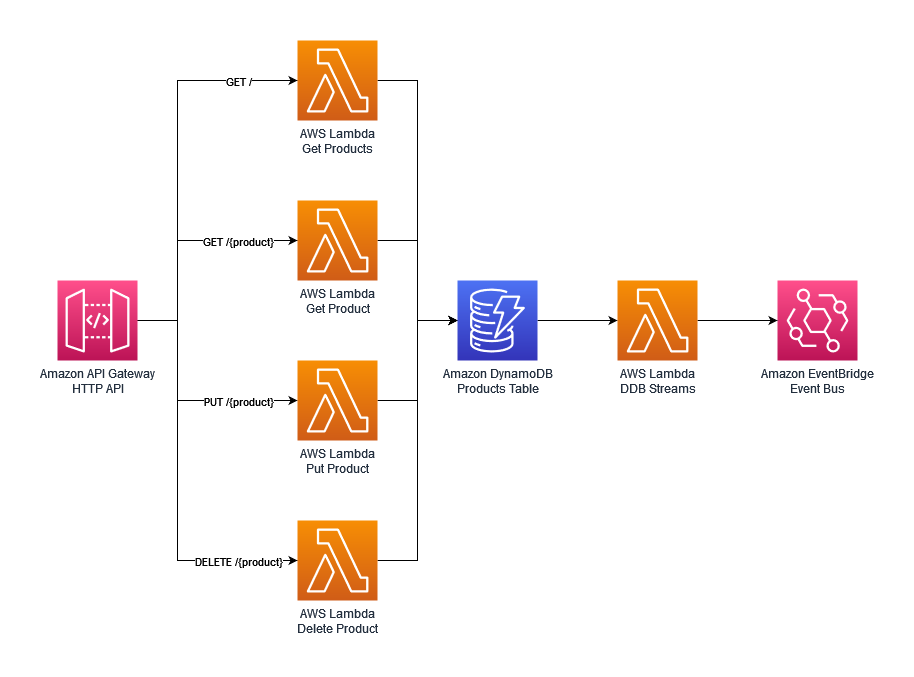

## **The Pragmatic Python Serverless Developer**

## **The Problem**

Starting a Serverless service can be overwhelming. You need to figure out many questions and challenges that have nothing to do with your business domain:

- How to deploy to the cloud? What IAC framework do you choose?
- How to write a SaaS-oriented CI/CD pipeline? What does it need to contain?
- How do you handle observability, logging, tracing, metrics?
- How do you handle testing?

## **The Solution**

### The Products service

### **Features**

While the code examples are written in Python, the principles are valid to any supported AWS Lambda handler programming language.

## **License**

This library is licensed under the MIT License. See the [LICENSE](https://github.com/ran-isenberg/serverless-python-demo/blob/main/LICENSE) file.

Maintained by [Ran Isenberg](https://www.ranthebuilder.cloud/) and Heitor Lessa
